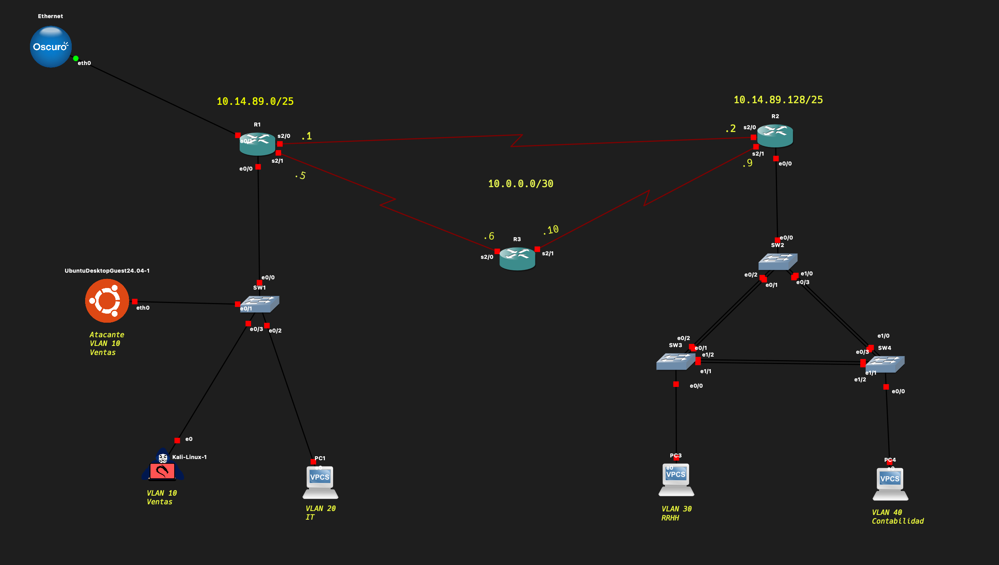

# VTP Attack - VLAN Injection

## Descripción

Este proyecto demuestra un ataque de **VTP (VLAN Trunking Protocol) Attack** para inyectar o eliminar VLANs en la base de datos de un switch. El ataque explota la sincronización automática de VTP entre switches para modificar la configuración de VLANs en toda la red.

## Topología de Red



## Entorno del Laboratorio

| Dispositivo | Dirección IP | Función |
|-------------|--------------|---------|
| **Ubuntu (Atacante)** | `10.14.89.5` | Estación de Ataque |
| **Kali (Víctima)** | `10.14.89.4` | Objetivo / Víctima |
| **Switch** | `10.14.89.1` | Nodo de Red (Víctima de VTP) |

- **Segmento de Red:** 10.14.89.0/26 (Rango útil: .1 a .62)
- **Dominio VTP:** `branyel.local`

## ¿Qué es VTP?

**VLAN Trunking Protocol (VTP)** es un protocolo propietario de Cisco que permite la gestión centralizada de VLANs. Cuando un switch en modo "Server" modifica su base de datos de VLANs, los cambios se propagan automáticamente a todos los switches en modo "Client" dentro del mismo dominio VTP.

### Modos VTP

| Modo | Descripción |
|------|-------------|
| **Server** | Puede crear, modificar y eliminar VLANs. Propaga cambios. |
| **Client** | No puede modificar VLANs. Sincroniza con el servidor. |
| **Transparent** | No participa en VTP. Cambios locales solamente. |

## Pre-requisitos

Este ataque requiere que primero se haya establecido un **enlace Trunk** con el switch. Esto se puede lograr mediante un **DTP Attack** previo.

## Requisitos

- Python 3.x
- Scapy (`pip install scapy`)
- Yersinia (herramienta de ataques L2)
- Permisos de superusuario (root)
- Enlace Trunk establecido previamente

## Instalación

```bash
# Clonar el repositorio
git clone https://github.com/tu-usuario/VTP_Attack_VLAN_Injection.git
cd VTP_Attack_VLAN_Injection

# Instalar dependencias
pip install scapy
sudo apt install yersinia  # En sistemas Debian/Ubuntu
```

## Uso

```bash
sudo python3 VTP_Attack.py
```

## Tipos de Ataque VTP

### Ataque Tipo 1: VTP Bombing (Borrado Masivo)
Elimina todas las VLANs de la base de datos del switch, causando interrupción del servicio.

### Ataque Tipo 2: VLAN Injection (Inyección)
Agrega nuevas VLANs a la base de datos del switch de forma remota.

**Configuración en el script:**
```python
ataque_tipo = "1"  # 1 = Borrar VLANs, 2 = Agregar VLAN
```

## Cómo Funciona el Ataque

### Paso 1: Verificar Enlace Trunk
El script primero escucha en la interfaz para confirmar que existe un enlace trunk activo, detectando paquetes de capa 2 (LLC).

### Paso 2: Detectar Protocolo VTP
Se identifican paquetes con destino `01:00:0c:cc:cc:cc` (multicast de Cisco) que indican comunicación de protocolos de capa 2.

### Paso 3: Lanzar Yersinia
El script ejecuta Yersinia con los parámetros correspondientes al tipo de ataque seleccionado:

```bash
# Ataque 1: Borrado masivo
sudo yersinia vtp -attack 1 -i ens3

# Ataque 2: Inyección de VLAN
sudo yersinia vtp -attack 2 -i ens3
```

### Paso 4: Propagación VTP
Los switches en el dominio VTP sincronizan los cambios, afectando a toda la red.

## Procedimiento de Inyección de VLAN (Yersinia Interactivo)

Para usar Yersinia en modo interactivo:

```bash
sudo yersinia -I
```

1. Presionar `g` para ir a VTP
2. Presionar `e` para editar parámetros
3. Configurar:
   - **Domain:** `branyel.local`
   - **VLAN ID:** `10`
   - **VLAN Name:** `VLAN10`
4. Presionar `x` para ejecutar el ataque

## Verificación del Ataque

En el switch Cisco, verificar las VLANs:

```
Switch# show vlan brief

VLAN Name                             Status    Ports
---- -------------------------------- --------- -------------------------------
1    default                          active    Gi0/0, Gi0/1, Gi0/2
10   VLAN10                           active    
```

También verificar la configuración VTP:

```
Switch# show vtp status
```

## Flujo del Ataque

```
┌─────────────────────────────────────────────────────────────┐
│                    ATAQUE VTP                               │
└─────────────────────────────────────────────────────────────┘

    1. DTP Attack (Pre-requisito)
    ┌─────────────┐                      ┌─────────────┐
    │  Atacante   │ ══════════════════▶  │   Switch    │
    │ 10.14.89.5  │   Forzar Trunk       │ 10.14.89.1  │
    └─────────────┘                      └─────────────┘

    2. VTP Attack
    ┌─────────────┐   Paquete VTP        ┌─────────────┐
    │  Atacante   │ ══════════════════▶  │   Switch    │
    │ 10.14.89.5  │   (Rev# Mayor)       │ 10.14.89.1  │
    └─────────────┘                      └─────────────┘
                                                │
                        Sincronización VTP      │
                                                ▼
                                         ┌─────────────┐
                                         │   Switch 2  │
                                         │   (Client)  │
                                         └─────────────┘
```

## Impacto del Ataque

### VTP Bombing (Ataque 1)
- **Eliminación de VLANs:** Todas las VLANs configuradas son eliminadas
- **Interrupción de servicio:** Los hosts pierden conectividad
- **Propagación:** Afecta a todos los switches del dominio

### VLAN Injection (Ataque 2)
- **Creación de VLANs maliciosas**
- **Preparación para otros ataques** (VLAN Hopping)
- **Modificación de la infraestructura de red**

## Mitigaciones

### 1. Usar VTP Versión 3
```
Switch(config)# vtp version 3
```

### 2. Configurar Contraseña VTP
```
Switch(config)# vtp password C0ntr4s3ñ4_S3gur4!
```

### 3. Usar Modo Transparent
```
Switch(config)# vtp mode transparent
```

### 4. Deshabilitar VTP (Recomendado)
```
Switch(config)# vtp mode off
```

### 5. Configurar VTP Pruning
```
Switch(config)# vtp pruning
```

### 6. Prevenir DTP Attack primero
```
Switch(config-if)# switchport mode access
Switch(config-if)# switchport nonegotiate
```

## Estructura del Proyecto

```
VTP_Attack_VLAN_Injection/
├── VTP_Attack.py        # Script principal del ataque
├── Topologia_GNS3.png   # Diagrama de la topología de red
└── README.md            # Esta documentación
```

## Tecnologías Utilizadas

- **Python 3**
- **Scapy** - Detección de paquetes de red
- **Yersinia** - Herramienta de ataques de capa 2
- **GNS3** - Simulador de red
- **Cisco IOS** - Sistema operativo del switch

---

## Descargo de Responsabilidad

> **⚠️ AVISO IMPORTANTE**
> 
> Este script fue desarrollado **exclusivamente con fines educativos** como parte del laboratorio de la materia **Seguridad de Redes** en el **Instituto Tecnológico de Las Américas (ITLA)**.
> 
> El uso de estas herramientas en redes sin autorización explícita es **ilegal** y puede conllevar consecuencias legales severas.
> 
> **Estudiante:** Branyel Pérez  
> **Matrícula:** 2024-1489  
> **Docente:** Jonathan Rondón  
> **Institución:** Instituto Tecnológico de Las Américas (ITLA)
